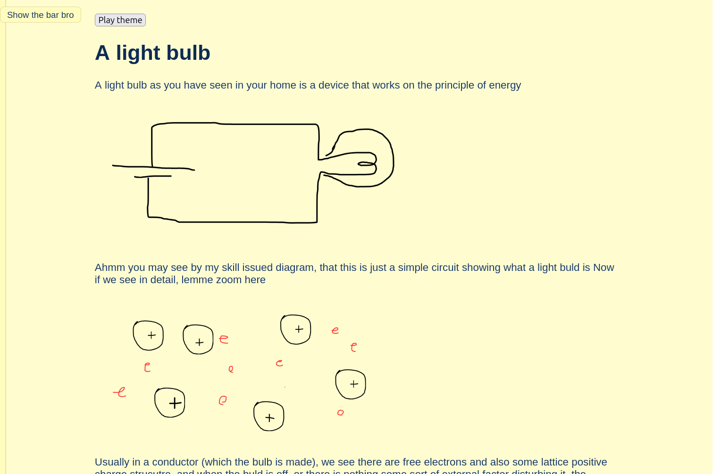

# ATPL
ATPL, a short abbrevation of A tiny Physics Library :D, and do you know, what that is?! Its explaining basic phenomena with the theory!!
ATPL is a short wiki type website where you can know and learn about how several things work, like how a light buld lights actually, or how a microwave works, with cool animations and graphics (which are certainly drawb by me and looks like a 2 yrs old kid drawing)
But checking the site would be worth your time, as well as would tell you something new

Features
The website is small, and is now only programmed for tablets or laptop layout
Everyday examples: osmosis, pressure, friction, wave, electricity in daily life
Frontend: HTML5, CSS3, JavaScript
Hosted on Github :D
## Getting started
```bash
git clone https://github.com/Undertakeryami/ATPL
cd ATPL
```
The D files are nothing but images, which i hand drew, as well as the index.html is the main homepage, but opening any .html you could acess the homepage with the bar


Here are some pictures attached.


For the Main page here are some more pictures attached to it :D



## Explaining the motivation behind making the website
The main motivation for me to make the website was to just try to collect my experiences with physics and try to make them accesable to you so you could enjoy physics in the same flavour or understanding for smaller concepts like i had.

